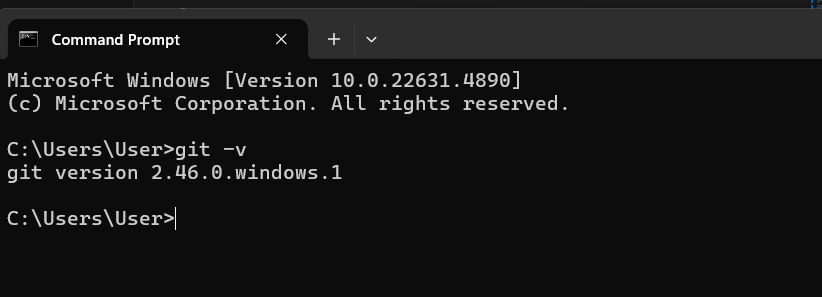
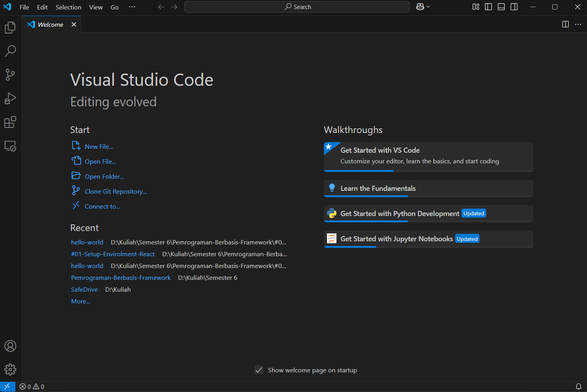

This is a [Next.js](https://nextjs.org/) project bootstrapped with [`create-next-app`](https://github.com/vercel/next.js/tree/canary/packages/create-next-app).

## Getting Started

First, run the development server:

```bash
npm run dev
# or
yarn dev
# or
pnpm dev
# or
bun dev
```

Open [http://localhost:3000](http://localhost:3000) with your browser to see the result.

You can start editing the page by modifying `app/page.tsx`. The page auto-updates as you edit the file.

This project uses [`next/font`](https://nextjs.org/docs/basic-features/font-optimization) to automatically optimize and load Inter, a custom Google Font.

## Laporan Praktikum


|       | Pemrograman Berbasis Framework 2025 |
| ----- | ----------------------------------- |
| NIM   | 2241720085                          |
| Nama  | Fajar Bayu Kusuma                   |
| Kelas | TI - 3C                             |
---
<br>

# Praktikum 1: Menyiapkan Lingkungan Pengembangan

## Pertanyaan Praktikum 1

#### 1. Jelaskan kegunaan masing-masing dari Git, VS Code dan NodeJS yang telah Anda install pada sesi praktikum ini!
**Jawab:**
> **Git**  
> Git adalah sistem kontrol versi terdistribusi yang digunakan untuk melacak perubahan kode dalam proyek pengembangan perangkat lunak. Dengan Git, pengembang dapat:  
> - Menyimpan riwayat perubahan kode.  
> - Berkolaborasi dengan tim menggunakan repository seperti GitHub atau GitLab.  
> - Mengelola versi proyek secara efisien.  
> **VS Code (Visual Studio Code)**  
> VS Code adalah editor kode sumber yang ringan dan kaya fitur, digunakan untuk menulis, mengedit, dan menjalankan berbagai bahasa pemrograman. VS Code mendukung:  
> - **Ekstensi** untuk berbagai bahasa dan alat pengembangan.  
> - **Debugging** langsung dalam editor.  
> - **Terminal bawaan** untuk menjalankan perintah.  
> - **Integrasi dengan Git dan Node.js** untuk pengembangan yang lebih mudah.  

> **Node.js**  
> Node.js adalah runtime JavaScript yang berjalan di sisi server, memungkinkan pengembang untuk membangun aplikasi berbasis JavaScript di luar browser. Node.js digunakan untuk:  
> - Membuat **server web** dan API backend.  
> - Mengembangkan aplikasi **real-time** seperti chat dan streaming.  
> - Mengelola pustaka dan modul menggunakan **npm (Node Package Manager)**.  

> 

#### 2. Buktikan dengan screenshoot yang menunjukkan bahwa masing-masing tools tersebut telah berhasil terinstall di perangkat Anda!
**Jawab:**
> git </br>


>VS CODE </br>


> Node js</br>


---

# Praktikum 2: Membuat Proyek Pertama React Menggunakan Next.js

## Pertanyaan Praktikum 2

#### 1. Pada Langkah ke-2, setelah membuat proyek baru menggunakan Next.js, terdapat beberapa istilah yang muncul. Jelaskan istilah tersebut, TypeScript, ESLint, Tailwind CSS, App Router, Import alias, App router, dan Turbopack!


### TypeScript  
TypeScript adalah JavaScript dengan fitur **static typing** yang membantu mendeteksi kesalahan lebih awal dan meningkatkan keterbacaan serta skalabilitas kode.  

### ESLint  
ESLint adalah alat untuk **menganalisis dan memperbaiki kesalahan kode** di JavaScript dan TypeScript, membantu menjaga standar kode agar lebih rapi dan konsisten.  

### Tailwind CSS  
Tailwind CSS adalah framework CSS berbasis **utility-first** yang memungkinkan pengembang membuat desain tanpa menulis banyak CSS secara manual.  

### App Router  
App Router di Next.js adalah sistem routing berbasis folder `app/` yang memperkenalkan fitur **Server Components, Layouts, dan Streaming**, meningkatkan fleksibilitas dan kinerja aplikasi.  


#### 2. Apa saja kegunaan folder dan file yang ada pada struktur proyek React yang tampil pada gambar pada tahap percobaan ke-3

**Folder .next** <br>
Next.js menyimpan file dan data yang diperlukan untuk menjalankan aplikasi di sisi server, seperti build output, halaman statis yang di-generate, dan cache. <br>

**Folder node_modules** <br>
Folder ini berisi dependensi proyek, yaitu library atau paket npm yang digunakan dalam aplikasi React. Ketika kamu menginstal paket menggunakan perintah npm install atau yarn, folder ini akan berisi semua paket yang dibutuhkan untuk menjalankan aplikasi, seperti React itu sendiri, serta paket lainnya.

**Public**<br>
Folder ini digunakan untuk menyimpan file statis yang bisa diakses langsung oleh browser, seperti gambar, favicon, dan file HTML utama (misalnya index.html di dalam proyek React). Semua file dalam folder public dapat diakses melalui URL yang langsung sesuai dengan lokasi file tersebut di dalam folder.

**src/app** <br>
Folder ini biasanya berisi kode sumber aplikasi kamu. Dalam React, folder src digunakan untuk menyimpan komponen, file konfigurasi, dan logika aplikasi. Subfolder app mungkin digunakan untuk mengorganisir komponen aplikasi yang lebih besar atau sebagai entry point untuk aplikasi dalam proyek Next.js.


#### 3. Buktikan dengan screenshoot yang menunjukkan bahwa tahapan percobaan di atas telah berhasil Anda lakukan!
>Proyek Pertama </br>


---

# Praktikum 3: Menambahkan Komponen React (Button)
## Pertanyaan Praktikum 3

#### 1. Buktikan dengan screenshoot yang menunjukkan bahwa tahapan percobaan di atas telah berhasil Anda lakukan!
>Hasil My Buttton </br>

---

# Praktikum 4: Menulis Markup dengan JSX
## Pertanyaan Praktikum 4

#### 1. Untuk apakah kegunaan sintaks `user.imageUrl`?
**Jawab:** <br>
`user.imageUrl` digunakan untuk mengakakses url dari image yang ingin digunakan
#### 2. Buktikan dengan screenshoot yang menunjukkan bahwa tahapan percobaan di atas telah berhasil Anda lakukan!
**Jawab:** <br>
>VS CODE </br>
